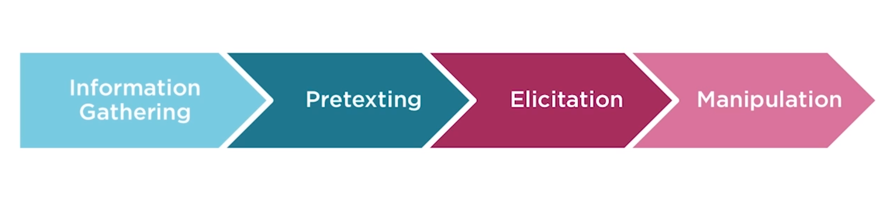

# Social Engineering
## Definition:
* Act of influencing someone to take an action that may not be in their best interest

> Course Objectives
* Define Social Engineering
* How to approach it
* How to defend yourself from it

> Types of Attacks
* Phishing
    * Fake webpage / email
* Vishing
    * Attack by telephone - Hi you have a new virus on your system.. I am from microsoft and I can fix it for some money
* Impersonation
    * Person pretending to be someone else

> Phishing Stastics
* 90% of all email is spam
* Phishing represents 77% of all social based attacks
* Clicking links in emails accounted for 88% of all reported phishing

> Vishing Statistics
* 2.4 million customers targeted for phone fraud in 2012
* 2.3 million cutomers targeted for phone fraud in first half of 2013
* Average loss for targeted business $42,546 per account

> People who use social engineering
* Hackers
* Pen Testers
* Spies
* Identity Thieves
* Disgruntled Employees
* Recruiters
* Governments
* Sales People
* Children

>  Reason why Social Engineering is so popular>
* Bcoz it works
* People are biggest vulnerability to any network
    * People like to be helpful to everyone in general
* Path of least resistance

> Common types of attack appraoches
* Customer Service
    * Can I please get a password reset on my account -  __ **Very easy way to get access to someones account** __ 
* Delivery Staff
    * Parcel boy delivering parcels - __ **Hi Can you please the door for me I am carrying this huge parcel box.. This is how I can get inside a building** __
* Phone Calls
    * Get internal phone numbers of a company and get information from inside
* Tech Support  

> Famous Hackers
* Kevin Mitnick
    * Books written by him - 
        * The art of Intrusion
        * The art of Deception
        * Ghost in the Wires
* Frank Abagnale
    * Famous movie on him 
        * Catch me if you can
* Charles Ponzi
    * Pyramid Scheme

# A framework for Social Engineering

> ## Framework Details
* > Information Gathering
    * A social engineering attack takes a lot of prepration
    * This requires gathering information. Information can be gathered from 
        * Dumpster Diving - Search bank statements / financial docs/ prescription data / Alcohol from garbage 
        * Socail Media - Faccebook, Twitter, Linkedin, Google, Bing
        * Malware - Keyloggers
        * Shoulder Surfing - Someone watching your mobile / laptop screen on busses/ from a window
* > Pretexting
*  The practice of presenting oneself as someone else in order to obtain private information
    * This is more than just creating a lie
    * This is creating a new identity
    * Using this identity to manipulate the reciept of information
    * Impersonate people in certain jobs and roles that they have never done themselves
    * Develop many different pretexts over their career 
    * Research
    * Can be done over a long time - weeks / months

* Principles - 
    * Planning and research leads to more success
    * Shared interests make success more likely
        * If wine bottles are found around, It means rapport can be built based on interest on types of wines.
        * Football / sports are a great way to build rapport with the target
        * Observe for ideas - dumpster diving events lead to a discovery of car magzines, cars are the topic to build rapport with the target
    * Good acting definitely helps
    * Keep it simple
        * Do not go overboard with complexity. The accomplice needs to be calm and relaxed and not say anything that screws up the situation. So keep it simple for good performance.
        * Start with the superficial topics / then narrow it down to professional interests based on comfort level established so far.
    * Use information that needs no verification

* Pretexting Planning - 
    * Define what you aim to achieve - Write it down if necessary (Draw conceptual map)
    * Plan for different reactions that stray off the happy path
        * What if the target was expected to like cars and **Cars** has been the planned topic to build rapport upon. But after meeting the victim, it turns out victim does not like cars, The accomplice must have a plan ready for all the edge cases / unexpected situations. This requires a lot of planning
    * Will ** __just being friendly__ ** be sufficient?

> Elicitation
* The act of getting information without directly asking for it
    * __oh man...! I forgot the door pincode again..I am such a dummy. Mark from behind says....Oh lol, again? wtf haha the pin code is 12340. Make sure you write it down somewhere bro.__
    * Exploiting human nature-  Advantages can be taken as
        * Most people want to be polite
        * People want to appear well-informed
            * Asking a question that is of common knowledge to the company is very likey to be said out loud by an employee without much intellectual / emotional resistance 
        * People want to be appreciated
            * __Oh if I can get the answer to this question... it would just make my day John__. John does not know who I really am given its a company of 12000 people / large organization. John just wants to be helpful as he wants to fit in with other polite employees
        * Honest people don't like to withold information or lie
    
    * Path to success for Elicitation - 
        * Understand how to communicate with people
        * Adapt communication to fit a situation
        * Build a bond with your target
        * Stay within the character of your pretext
        * __Use effective question techniques__